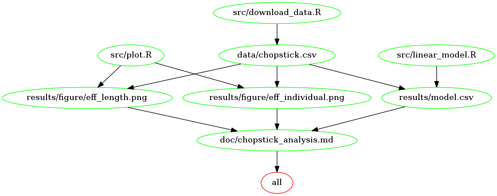

# Chopstick Effeciency Analysis


### Identify Dataset

This project accesses data from the yhat [blog](http://blog.yhat.com/posts/7-funny-datasets.html).

In particular I download and analyze the dataset about the chopstick effeciency.

| Variable |    Description      |  Class |
|----------|:-------------:|------:|
| Food.Pinching.Effeciency | peanuts picked and placed in cup | Real |
| Individual |  different person index | Integer |
| Chopstick.Length | the length of the chopsticks (mm) | Integer |

### Question

The objective of this analysis is to investigate whether different individuals and chopstick lengths can have effects on the chopstick effeciency.

### Hypotheses

Null hypothesis: `Individual` and `Chopstick.Length` have no effects on `Food.Pinching.Effeciency`.

Alternative hypothesis: `Individual` and `Chopstick.Length` have effects on `Food.Pinching.Effeciency`.

### Results

The results reject the null hypothesis and claim that `Individual` and `Chopstick.Length` actually have effects on the effeciency of chopsticks.

Furthermore, the boxplots seem to show that individual 9 performs best on using chopsticks and the chopsticks with length 240mm are the most effecient.

### Dependencies

We can use `packrat` to manage package dependencies:

- `readr` v 1.1.1
- `ggplot2` v 2.2.1
- `ezknitr` v 0.6
- `packrat` v 0.4.8-1
- `tidyverse` v 1.1.1
- `broom` v 0.4.2

### How to run the analysis

There are three options for running the full analysis after the repository is cloned.

1. If you have Docker installed, you can use a combination of `make` and `docker`. 

	First pull the relevant docker image for the project,

	```
	docker pull yao2013/chopstick
	```
	
	Then clone the repository,
	
	```
	git clone https://github.com/yllz/Chopstick.git
	```

	The analysis now can be run by using,
	
	```
	docker run --rm -v /local/path/to/Chopstick:/home/Chopstick yao2013/chopstick make -C '/home/Chopstick'
	```

	To remove the data, documents, and figures generated from the analysis,

	```
	docker run --rm -v /local/path/to/Chopstick:/home/Chopstick yao2013/chopstick make -C '/home/Chopstick' clean
	```

2. If you prefer to manually install the R packages listed above in the *Dependencies* part, you can run the analysis in the cloned repository directory using the following command.

	```
	make all
	```

	Generated data, documents, and figures can then be removed using

	```
	make clean
	```
	
	And the Makefile dependency graph looks like this: 
	
	

3. Scripts can then be run manually, although the local paths will need to be explicitly defined as arguments within those scripts. A packrat file is included, so all the dependencies for the project is contained. Open the `Rproject` file, and all relevant packages will be temporarily installed to run the analysis. 
