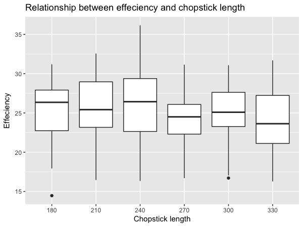

```{r setup, include=FALSE}
knitr::opts_chunk$set(echo = TRUE)
```

## Introduction

Chopsticks are one of the most simple and popular hand tools ever invented by humans. A few researchers recorded the individuals using chopsticks, the length of chopsticks and the number of peanuts picked and placed in cup to measure how effective a pair of chopsticks performed.

## Analysis

Firstly, we fit a linear reggression model on the dataset. 

The explanatory variables are `Individual` and `chopstick.Length`, but factorization is needed to make them categorical. And the response variable is `Food.Pinching.Effeciency`.

Null hypothesis: Individual and chopstick length do not affect the effeciency of chopsticks.

Alternative hypothesis: Individual and chopstick length have effects on the effeciency of chopsticks.

```{r}
read.csv("../results/model.csv", sep=",", header=TRUE)
```

Based on the summary, both individual and chopstick.length conatin factors with p-values much smaller than the significance level, so we reject the null hypothesis and claim that individual and chopstick length do have effects on the effeciency of chopsticks.

We can also simply use `plot(model)` to get the diagnostic plots of the model, and there are no clear patterns. So the assumptions of equal variance (homoscedasticity) and normality of residuals are satisfied. Besides, the R-square is 0.7898, which means that 78.98% variation in the response vriable is explained by the model. So this model fits well.

Then we make visualiztions to check the relationship between the response variable and explanatory variables. The first plot below is between effeciency and individual. From the output, we can see that different individuals have very different behaviours since the medians and the variances vary a lot, and individual 9 performs best.

The second plot below is between effeciency and chopstick length. Based on the plot, we can see that the median differenes are less substantial than those in individual plot, but they differ much in variances. And it seems that the chopsticks with length 240mm are the most effecient.




## Conclusion

The results show that the food-pinching performance was significantly affected by the individual and length of the chopsticks, and that chopsticks of about 240mm long are optimal for most people.
